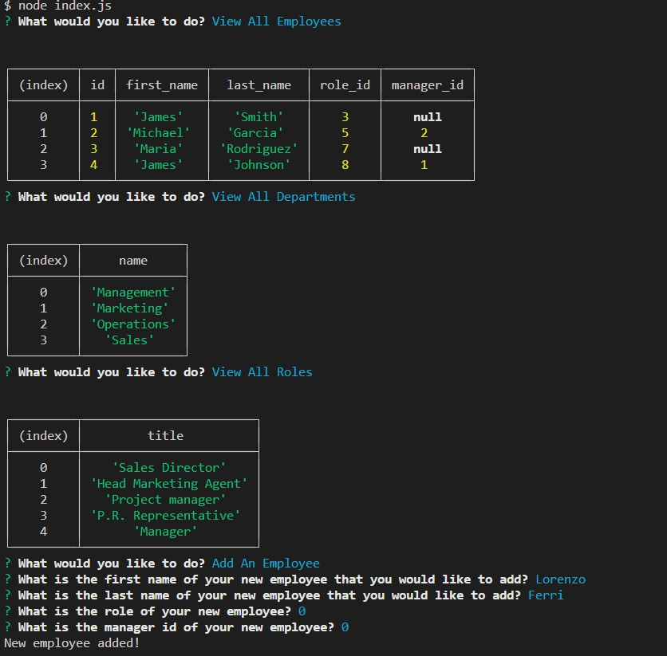

#  EmployeeOrganizer

## Purpose

This application is used to interact with a mySQL database to organize, make, and manage a company and it's employees, departments, and roles.

## Installation

Requires inquirer, mysql, and console.table, use run npm i in the root folder, then run node index.js.

## Repo

https://github.com/LorenzoFTSIC/EmployeeOrganizer

